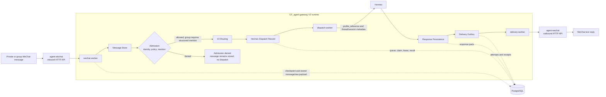

# V2 WeChat Runtime Architecture

## Scope and status

The V2 WeChat runtime is the production message path in CF_agent-gateway at commit
`2ac4c86` (`v2-enterprise-runtime-20260811`). The code implements durable polling,
persist-first admission, V2 routing, Hermes dispatch, response persistence, and
asynchronous delivery. On 2026-08-13, the five-service CFserver deployment and the
unauthorized-message safety path were verified on a real host. On 2026-08-14, authorized
private and explicitly mentioned group text paths completed the runtime through actual
WeChat receipt. The same-day evidence also covers private and `group_sender` thread reuse,
application-process restart persistence, and no observed echo redispatch.

This status covers text only. It does **not** establish inbound Attachment creation, Hermes
multimodal input, Artifact materialization, image/file delivery, automatic `uncertain`
recovery, container recreation, or host/database restart recovery. See the
[2026-08-13 baseline](../validation/2026-08-13-wechat-runtime.md) and the
[2026-08-14 follow-up](../validation/2026-08-14-wechat-private-group-media-runtime.md).

## Runtime flow

`agent-wechat` and Hermes are external boundaries. The Gateway reaches `agent-wechat`
through its container DNS URL, `http://cf-agent-wechat:6174`, and reaches Hermes through a
deployment-specific URL such as `http://<AI_HOST_LAN_IP>:<HERMES_PORT>`. Tokens and API
keys are supplied through environment variables; they are not stored in YAML.

Gateway owns its Agent Profile and immutable route snapshot, not the Hermes profile
lifecycle. `AgentProfile.external_profile_ref` selects an already existing Hermes profile
and is sent as `profile_reference`. Gateway does not create, clone, or modify that external
profile. The Hermes profile carries its configuration, skills, and `SOUL.md`; the Gateway
Thread Policy independently determines context isolation. The private and group routes
live-tested on 2026-08-14 both selected `external_profile_ref=default` while retaining
different AI Threads and Hermes Thread IDs.

## Worker responsibilities

| Process | Entry point | Responsibility |
| --- | --- | --- |
| `wechat-worker` | `python -m cf_agent_gateway.runtime.worker` | Poll login state, chats, and messages; maintain per-account/per-conversation Checkpoints; normalize non-self messages; commit Message Store records; run Admission and V2 Routing; enqueue allowed Hermes Dispatch Records. |
| `dispatch-worker` | `python -m cf_agent_gateway.runtime.dispatch_worker` | Claim durable dispatch records with a token and renewable lease; enforce per-thread FIFO; call Hermes with a stable idempotency key; persist the Hermes result; create the durable response and Delivery Outbox handoff. |
| `delivery-worker` | `python -m cf_agent_gateway.runtime.delivery_worker` | Claim WeChat Delivery Outbox records; send ordered text or conditionally available image/file parts through `agent-wechat`; record each Delivery Attempt and provider Receipt; retry only outcomes known to be retryable. |

Polling never calls Hermes or sends a reply inline. Once the corresponding Dispatch Record
or Delivery Outbox record has committed, queue and claim state survives process restarts in
PostgreSQL rather than process memory. The transaction boundary before Delivery Outbox
creation has a separate reconciliation limitation described below.

## Ingestion, Checkpoints, and persist-first

The poller owns a durable Checkpoint keyed by `source_account_id` and
`conversation_id`. Messages are validated and ordered by the source `localId`. For each
message above the Checkpoint:

1. A raw message with `isSelf=true` is filtered before normalization and Message Store,
   but its Checkpoint still advances. This prevents the bot's own reply from entering a
   response loop.
2. Every other message is normalized and inserted into Message Store. That insert commits
   before Admission begins.
3. Admission resolves source identity, user policy, gateway policy, mention state, and risk.
4. When allowed, V2 Routing resolves the Agent Profile, Group Type where applicable,
   thread policy, Workspace, and AI Thread. The selected profile revision and thread policy
   are bound as a route snapshot.
5. One durable Hermes Dispatch Record is committed for the stored message.
6. Only after the sink returns successfully does the poller advance the Checkpoint.

Consequently, an unauthorized non-self message remains in Message Store but creates no
Hermes Dispatch Record and no Delivery Outbox record. Identity mapping alone is not an
authorization grant. Adding authorization later does not automatically replay a denied
message whose Checkpoint has already advanced.

### Live Admission and thread evidence

The 2026-08-14 private test resolved the configured identity and both policy layers,
then selected the private Conversation-AgentProfile Binding and created its Workspace and
`private_sender` AI Thread during V2 Routing. The final Admission outcome was `allowed`,
and the request completed a text reply. A later request reused that same AI Thread, Thread
Key, and Hermes Thread ID.

In the group test, a message with `is_mentioned=false` was persisted but denied with
`bot_not_mentioned` and created no Dispatch. After an active
`cf-authorized-group-sender` Group Type was bound, a real WeChat member-selection mention
stored `is_mentioned=true`, passed Admission, and used `group_sender`. The route reused
the employee Workspace but created a group-specific AI Thread and Hermes Thread ID. A
second mentioned request reused that group thread. `group_shared` was not exercised.

Private and group reply messages were also recognized and retained non-empty
`reply_context`. Group reply content without a structured mention remained denied.
Hermes dispatch currently sends the message content and does not inject `reply_context`.

## Delivery guarantees and idempotency

### Polling: at least once

The sink runs before the Checkpoint write. If the sink commits and Checkpoint advancement
fails, the same source message is presented again on the next poll. Message Store uses
unique event and physical source-message identities, and dispatch enqueue uses a unique
key derived from the stored message ID, so this redelivery reuses existing durable state.
The contract is at-least-once processing with idempotent storage, not exactly-once source
delivery.

`bootstrap_mode=latest` is intentionally different from redelivery: the first observation
of a chat initializes its Checkpoint to the largest currently visible `localId` and skips
that visible history without normalization or storage. This applies both at first startup
and when a new chat first appears while the worker is already running.

### Hermes dispatch: leases, FIFO, and stable calls

Each admitted message has one Dispatch Record and a stable idempotency key. Claiming changes
the record to `running`, increments its attempt count, and commits a claim token and lease.
The worker renews the lease during the Hermes call. Database predicates and a partial unique
index ensure that only the oldest eligible record for an AI Thread can run and that a thread
has at most one running dispatch.

A definite retryable failure becomes `failed` and may be claimed again while its retry
budget remains. An expired `running` lease is also reclaimable. `worker.retry_limit` counts
retries after the first call, so the maximum number of claims is `retry_limit + 1`.
Ambiguous outcomes, including transport timeouts and relevant post-call failures, become
`uncertain`; they are not retried automatically and block later records on the same thread.
Hermes receives the Dispatch Record's stable `Idempotency-Key` on every eligible call.

One private reply Dispatch reached `uncertain` when Hermes Gateway was offline. After
Hermes health was restored, an operator used a database backup and strict evidence guards
to perform a one-off manual transition of that same Dispatch to `failed`; restarting
`dispatch-worker` then allowed its second attempt to succeed. This observation does not
change the runtime contract: `uncertain` is not automatically retried, restarting a worker
alone does not clear it, and the project has no supported management API or administrator
recovery command. The guarded incident is documented without SQL in the
[2026-08-14 validation record](../validation/2026-08-14-wechat-private-group-media-runtime.md).

### Delivery: Outbox, Attempt, and Receipt

The Delivery Outbox stores an ordered cursor over response parts. Before sending a part,
the worker commits a Delivery Attempt. After `agent-wechat` accepts the send, one transaction
records the provider Receipt, marks the Attempt delivered, advances the part cursor, and,
for the final part, marks both delivery and response delivered.

Known retryable failures are requeued with bounded exponential backoff. Permanent failures
become `failed`. Timeouts, transport failures, invalid provider responses, and an accepted
send whose Receipt cannot be committed become `uncertain`, because automatically sending
again could duplicate a visible WeChat message. A stale pre-send claim is requeued; a stale
claim with an in-flight Attempt is quarantined as `uncertain`.

Response, delivery-target, and per-part Attempt identities are stable and constrained by
the database. The current `agent-wechat` send request does not carry the Gateway's per-part
provider idempotency key, so the outbound boundary must not be described as exactly once.
The Receipt ledger is the durable evidence of accepted parts.

The private and mentioned-group text validations each observed a successful Attempt,
Receipt, and final `delivered` state. No live image or file response part was exercised.

## Media Runtime V2 boundary

The 2026-08-14 image test proved only discovery and retrieval boundaries. A non-mentioned
group image was classified as `message_type=image`, persisted with `raw_type=3`, source
identifiers, and Raw Payload, and created no Dispatch. The polling path created zero
Attachment rows. Separately, the `agent-wechat` media API returned 5,712 bytes with a valid
JPEG signature and a verified, unpublished SHA-256 digest.

The resident poller does not fetch those bytes, write them to Gateway private storage, or
create an Artifact. Hermes dispatch does not construct a multimodal request from the image.
No Hermes output Artifact was materialized, and no generated image was sent back to WeChat.
The outbound delivery worker's conditional image/file support is therefore code capability,
not a verified operational media pipeline. See
[WeChat Media Adapter V2](../wechat-media-adapter-v2.md).

## Transaction boundaries

The runtime deliberately uses several transactions and processes. The precise boundaries
matter during incident recovery:

1. **Message Store commit.** The normalized inbound message and its conversation metadata
   commit before Admission. An Admission or routing failure cannot erase the archive.
2. **Admission and dispatch enqueue.** Authorized routing state is resolved, and a unique
   Dispatch Record is committed before polling advances its Checkpoint.
3. **Dispatch claim.** The `running` transition, claim token, attempt count, and lease commit
   before the Hermes call.
4. **Hermes session advancement.** After a successful external call, the AI Thread's Hermes
   session progression commits in the dispatch execution session.
5. **Dispatch completion.** In a fresh, claim-token-fenced transaction, the raw Hermes result
   is inserted into `hermes_dispatch_responses` and the Dispatch Record changes from
   `running` to `success` atomically.
6. **Business response handoff.** After dispatch completion commits, a separate transaction
   creates `hermes_responses`, its ordered parts, and the matching `delivery_outbox` record
   atomically.
7. **Channel delivery.** Attempt creation commits before each provider call. Receipt and
   cursor advancement commit after provider acceptance.

There is a known handoff risk between steps 5 and 6. If business response persistence or
Delivery Outbox creation fails, the Dispatch Record remains `success` and the raw dispatch
response remains durable, but the dispatch worker does not reclaim that record and no
automatic reconciliation currently recreates the missing business response/outbox. The
worker logs a response-delivery error. Operations must detect and reconcile this state;
the message must not be resent to Hermes merely to repair the handoff.

The 2026-08-14 text runs observed this normal handoff succeed. They did not exercise the
failure or add automatic reconciliation, so the risk remains open.

## Shutdown and health

All three worker entry points translate `SIGINT` and `SIGTERM` into a stop event.

- `wechat-worker` finishes the current synchronous poll and exits; its interval wait is
  interruptible.
- `dispatch-worker` stops claiming new records, then waits for active Hermes calls to finish.
- `delivery-worker` finishes its current bounded drain before exiting.

On 2026-08-14, the four application processes (`gateway`, `wechat-worker`,
`dispatch-worker`, and `delivery-worker`) were restarted in their existing containers.
Their container IDs did not change, all four returned healthy, and persisted private route,
Dispatch, Response, Delivery, Attempt, and Receipt facts remained stable. A subsequent
private request reused its prior Workspace, AI Thread, Thread Key, and Hermes Thread ID.
PostgreSQL, `agent-wechat`, Hermes, and the CFserver host were not restarted. This is
process-level recovery evidence, not container recreation or host/database reboot evidence.

Shutdown grace periods therefore need to exceed the configured network timeouts and expected
active-call duration. Abrupt termination is handled through Checkpoint redelivery, dispatch
lease expiry, or delivery stale-claim recovery, with ambiguous provider calls quarantined.

Each resident worker publishes an atomic JSON heartbeat. The default publish interval is
10 seconds and the default health maximum age is 30 seconds. Only `starting` and `running`
are healthy states. Dispatch and delivery use a resident heartbeat thread; the WeChat worker
does not renew its heartbeat while blocked inside a poll, so a stuck poll becomes unhealthy
rather than presenting stale liveness as success.

## Related documentation

- [Overall architecture and project boundaries](../architecture.md)
- [WeChat polling runtime](../runtime/wechat-runtime.md)
- [Identity, access, and V2 routing](../security/identity-access-routing.md)
- [CFserver production deployment](../deployment/cfserver-production.md)
- [Runtime validation index](../validation/README.md)
- [2026-08-14 private, group, reply, and media validation](../validation/2026-08-14-wechat-private-group-media-runtime.md)
- [2026-08-13 baseline and unauthorized-path validation](../validation/2026-08-13-wechat-runtime.md)
- [WeChat Media Adapter V2](../wechat-media-adapter-v2.md)
