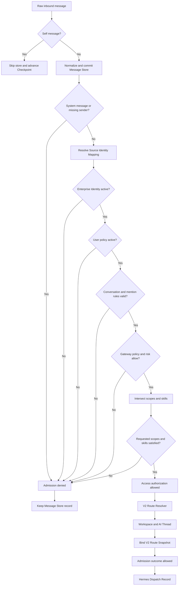

# Identity, access, and V2 routing

This document defines the authorization and routing contract for the V2 runtime. It is a
fail-closed pipeline: a source identity mapping identifies a sender, but it never grants
permission by itself. Authorization must succeed before the runtime resolves an AI route or
creates a Hermes Dispatch record.

## Security invariants

- Persist the normalized inbound message before Admission. Rejection and downstream
  failures do not erase the received record.
- Treat `(source, source_account_id, sender_id)` as source facts, not proof of permission.
- Require an active Enterprise Identity, active User Access Policy, and enabled Gateway
  Access Policy. Missing configuration denies access.
- Require an explicit bot mention in group conversations. Private conversations do not use
  mention state.
- Apply the requested Risk Level and the intersection of user and gateway permission and
  skill sets.
- Resolve workspaces, AI threads, Agent Profiles, and Thread Policy only after the identity
  and access decision is allowed. Emit an allowed Admission outcome only after routing
  succeeds.
- Never call Hermes and never create a Delivery Outbox entry for a denied message.
- Do not fall back to an arbitrary Agent Profile when routing configuration is missing or
  inactive.

The source identifiers in examples must use placeholders such as
`<BOT_WECHAT_ACCOUNT_ID>`, `<EMPLOYEE_WECHAT_SENDER_ID>`, and
`<PRIVATE_CONVERSATION_ID>`. Identity records and message content are sensitive even when
they are not credentials.

## Processing order



The active WeChat poller filters self messages before normalization and storage. For every
remaining normalized message, `MessageStore.create` commits before Admission begins.
Storage and Admission deliberately do not share one transaction. If the message is
redelivered, Message Store uniqueness and the Dispatch idempotency key reuse the existing
durable target instead of creating a second dispatch.

A denied Admission returns `should_create_task=false`; it does not create a Hermes Dispatch
record and therefore cannot create a Hermes response or Delivery Outbox entry. A routing
error after access authorization, such as a missing private Agent Profile binding, prevents
the orchestrator from emitting an allowed Admission outcome. It also fails closed: the
message remains stored, no dispatch is enqueued, and the poller may retry because its
checkpoint advances only after successful message handling.

## Identity entities

### Enterprise Identity

`enterprise_identities` is the stable internal identity for an employee. It may carry an
employee identifier and display name, and has `active`, `disabled`, or `archived` status.
Only an active identity can proceed through Admission.

An Enterprise Identity is not tied directly to one message platform. Its platform accounts
are connected through Source Identity Mappings.

### Source Identity Mapping

`source_identity_mappings` maps the unique source tuple
`(platform, account_id, sender_id)` to one Enterprise Identity. For WeChat, `account_id` is
the logged-in bot/source account and `sender_id` is the message sender.

Resolution outcomes are:

| Outcome | Meaning | Admission effect |
| --- | --- | --- |
| `resolved` | Exactly one enabled mapping points to an active identity | Continue to policy evaluation |
| `unresolved` | No mapping exists | Deny |
| `disabled` | Mapping disabled or identity not active | Deny |
| `conflict` | Mapping facts are ambiguous or inconsistent | Deny |

Creating or enabling a mapping only answers "who is this sender?" It does not answer "may
this sender use the Gateway?" A separate User Access Policy is mandatory.

## Access policies

### User Access Policy

`user_access_policies` has at most one policy per Enterprise Identity. It contains:

- `enabled`.
- `permission_scope`, the scopes the employee may use.
- `allowed_skills`, the skill identifiers the employee may invoke.
- Optional `valid_from` and `valid_until` boundaries.

A missing, disabled, not-yet-valid, or expired policy sets `user_allowed=false` and denies
the request. An active policy does not bypass Gateway policy; both layers must allow the
operation.

### Gateway Access Policy

`gateway_access_policies` contains the single `default` system policy. It defines:

- The system `permission_scope`.
- The system `allowed_skills`.
- `allowed_risk_levels`.
- Whether the policy is enabled.

Missing or disabled Gateway policy resolves to empty allowed sets. This is intentional
default-deny behavior.

### Effective permissions

The evaluator computes:

```text
effective_permission_scope = user_permission_scope intersect gateway_permission_scope
effective_allowed_skills = user_allowed_skills intersect gateway_allowed_skills
```

If a request names scopes or skills, they further restrict those intersections. A requested
scope or skill with no effective match denies the request. Empty request filters do not
grant new permissions or trigger the requested-scope/requested-skill denial; the effective
sets remain bounded by both policies.

### Risk Level

Risk Levels are `low`, `normal`, `high`, and `critical`. The default inbound request
resolver assigns `normal`. The requested Risk Level must be present in the Gateway Access
Policy's `allowed_risk_levels`; otherwise Admission denies with `risk_not_allowed`.

Risk approval is independent from identity mapping and skill/scope intersection. Grant only
the levels the production use case requires.

## Conversation Admission

### Private conversations

A private message is eligible only when all of the following are true:

1. It is neither a self message nor a system message and has a resolved sender.
2. The Source Identity Mapping and Enterprise Identity are active.
3. The User Access Policy is active and valid at evaluation time.
4. The default Gateway Access Policy is enabled.
5. Risk, requested scope, and requested skills pass evaluation.
6. V2 routing can resolve an active Agent Profile explicitly bound to the persisted private
   conversation.

Private conversation facts must not carry group mention state. A private message does not
need to mention the bot.

### Group conversations

Group Admission applies the same identity, user, gateway, risk, scope, and skill checks. It
also requires normalized `is_mentioned=true`. A general group message, inferred relevance,
quoted history, or a missing mention flag is not sufficient.

After Admission, the persisted group conversation resolves a Group Type. An explicit
Conversation-GroupType Binding takes precedence. If none exists, the resolver may use the
configured `unknown_group` Group Type; if that fallback is absent or inactive, routing
fails closed. Both the Group Type and its referenced Agent Profile must be active.

## Routing entities

### Agent Profile

`agent_profiles` identifies the Hermes/provider route using `profile_key`, immutable
`revision`, `provider`, external profile reference, and model. A profile revision can be
active, disabled, or archived. Its revision-defining fields cannot be updated or deleted;
publish a new revision instead.

Status is operational and still checked at route resolution. A disabled or archived
revision is not a valid route.

### Group Type

`group_types` classifies a group route. Each Group Type selects one Agent Profile revision
and one group Thread Policy, either `group_shared` or `group_sender`. Its status must be
active.

`unknown_group` is a deliberate configured fallback, not an implicit permissive default.
Do not create a broad fallback unless its profile and shared-context behavior have been
reviewed.

### Conversation-AgentProfile Binding

`conversation_agent_profile_bindings` assigns exactly one Agent Profile revision to a
persisted private conversation. Private V2 routing requires this binding. A binding may be
updated to point at a reviewed revision, but an existing AI Thread retains its stored route
snapshot.

### Conversation-GroupType Binding

`conversation_group_type_bindings` assigns one Group Type to a persisted group
conversation. It overrides the `unknown_group` fallback and controls both the Agent Profile
and group Thread Policy selected for new route resolution.

## Workspace and thread isolation

### Employee Workspace

`employee_workspaces` provides one stable workspace per Enterprise Identity. It is created
or reused only after the caller has authorized the identity. Workspace lookup is not an
authorization mechanism and must never be called as a substitute for Admission.

### AI Thread

`ai_threads` is the durable conversation context used for Hermes. It has a stable thread
key, a private or group type, status, optional Hermes thread identifier, and the V2 route
snapshot. Only active threads are usable.

`thread_source_bindings` records the source platform, source account, physical
conversation, and applicable sender relationship for a thread. These are routing facts;
they do not grant access.

### Thread Policy

The V2 thread key includes source account, physical conversation, Agent Profile revision,
and Thread Policy. Sender identity participation depends on the policy:

| Policy | Valid conversation | Isolation behavior |
| --- | --- | --- |
| `private_sender` | Private | Context is scoped to the private conversation, enterprise sender, and profile revision |
| `group_shared` | Group | Authorized participants in the group share one thread for the conversation and profile revision |
| `group_sender` | Group | Each enterprise sender receives a distinct thread within the group and profile revision |

`group_shared` intentionally shares context among authorized group participants. Use it
only where that disclosure boundary is acceptable; otherwise select `group_sender`.

### V2 Route Snapshot

Once V2 routing succeeds, the AI Thread stores `agent_profile_id` and `thread_policy`
together. The Agent Profile ID identifies an immutable revision, and the V2 thread key also
incorporates that revision. This pair is the durable V2 Route Snapshot.

The snapshot prevents a later configuration lookup from silently changing the route of an
existing thread. A conflicting attempt to bind another profile or policy is rejected.
Hermes Dispatch records then reference the admitted message, Enterprise Identity,
Workspace, and AI Thread as their stable dispatch target.

## Empty-configuration behavior

An empty production configuration is safe by default:

- No Source Identity Mapping means identity resolution is denied.
- A mapping without an active User Access Policy is still denied.
- A missing Gateway Access Policy denies every Risk Level.
- Missing private profile bindings or group routing configuration prevents dispatch.
- No denied or unroutable message calls Hermes or creates a Delivery Outbox entry.

Provision identities, mappings, both policy layers, profiles, and conversation bindings as
separate reviewed changes. Validate Admission and routing with placeholder-based audit
records before enabling a real response test.
